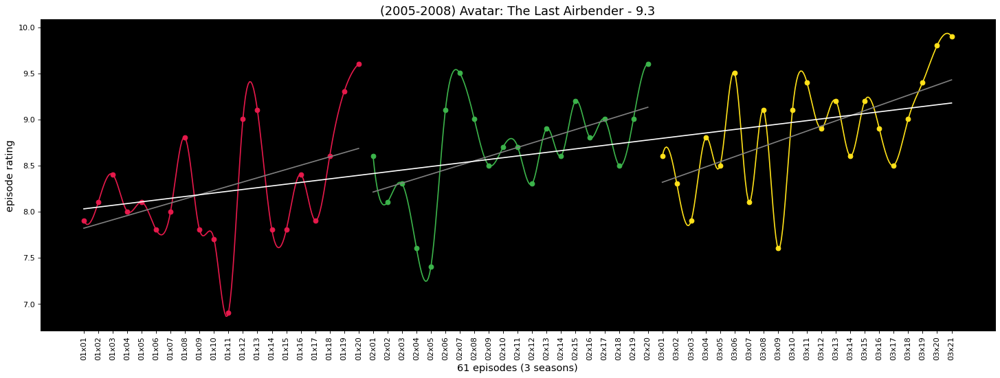
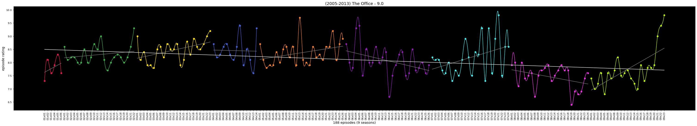

# Binging Stonks 📈️

Based on the now [deprecated service called "TV Graph"](https://web.archive.org/web/20170930164622/http://graphtv.kevinformatics.com/tt0903747), I decided to start this little project to revive the tool (at least locally). The idea behind is actually pretty simple: given a TV show, plot the imdb scores of each episode to see if investing time in it will provide much stonks.

# Try it out here!

## Examples

### Does your favorite TV show had as much stonks as you thought?

### Is it worth to invest your time on the sequel/prequel of a good show?

### Is it worth to invest your time on a show or it will go south by the end? (not stonks)

### Is it worth to invest your time that show everyone talks about?

### Is that old show really THAT good?

----

----

